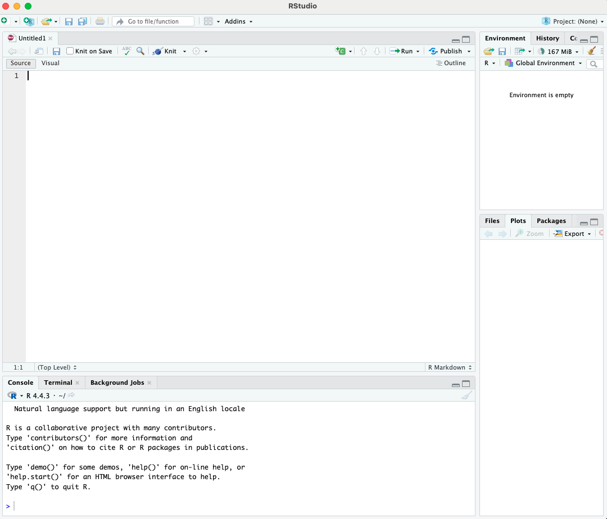

# Introduction to Markdown in R

## Getting started with Markdown in R

### What are the benefits of using Markdown in R?
(INSERT TEXT)
### How is Markdown implemented in R?
Markdown is implemented in R *via* a dedicated R package called `rmarkdown`.

#### Installing the `rmarkdown` package:
The `rmarkdown` package is available for download and installation through the Comprehensive R Archive Network (CRAN). This process can be undertaken by first opening RStudio and then performing the following click-button steps:

1. Click `Tools` at the top of the screen
2. Select `Install Packages...`
3. Keep the `Install from:` box set as `Repository (CRAN)`
4. Type `rmarkdown` into the `Packages` box
5. Ensure `Install dependancies` is ticked
6. Keep the `Install to Library:` box as the default path given
7. Click `Install`

Alternitively, after opening RStudio, `rmarkdown` can be downloaded and installed programatically by running the following command in the RStudio console:
```r
install.packages('rmarkdown')
```

#### Creating a new RMarkdown document:
Once the `rmarkdown` package has been installed, a new, blank RMarkdown document can be created in RStudio by:
1. Clicking `File` at the top of the screen
2. Selecting `New File`
3. Choosing `R Markdown...`
4. Clicking `Create Empty Document` on the resultant pop-up screen

Completing the above four steps should result in an RStudio window that looks like the following:


