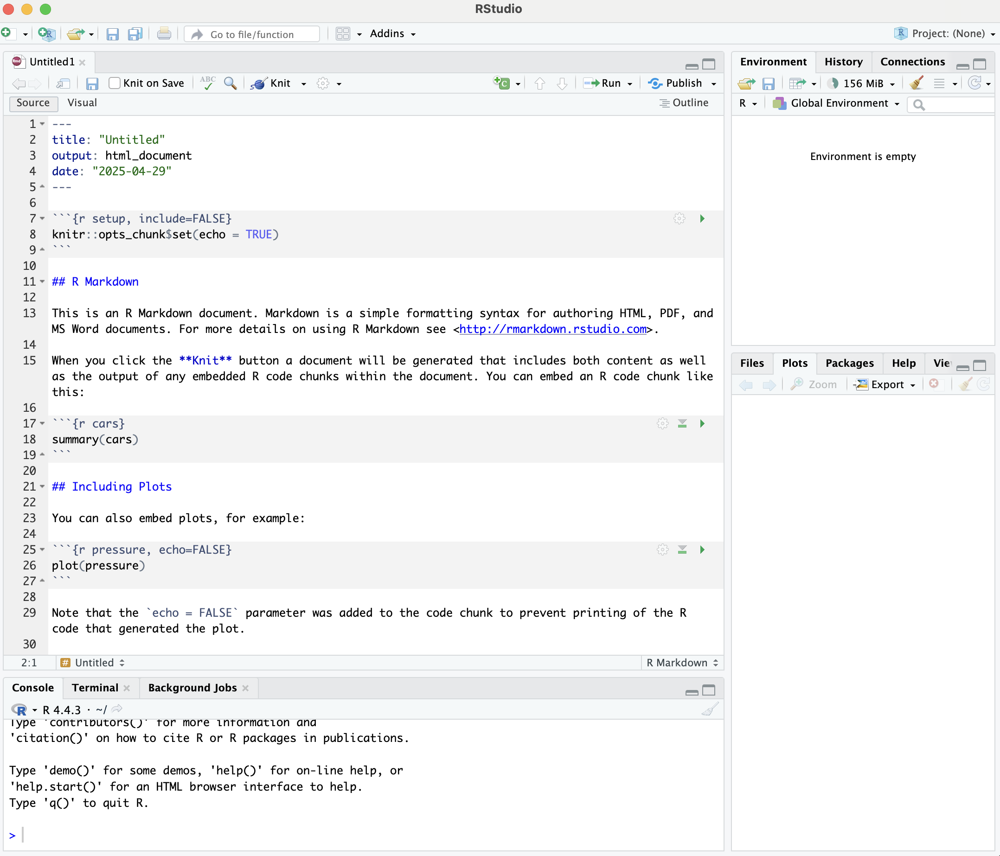

# Introduction to Markdown in R

## Components of an R Markdown document: a visual prelude
So far we have installed the `rmarkdown` package for producing markdown documents in R, and used it to initialise a blank R Markdown document. It is worthwhile noting that, whereas standard markdown files hold the `.md` file extention, raw R Markdown documents instead carry the `.Rmd` file extension. 

### What does a complete R Markdown document look like?
Adding contents to a raw R Markdown file will ultimately lead to something in the RStudio window that looks like the following:

### What are the main components of an R Markdown document?
The above image provides a snapshot of the core components that make up an R Markdown document, namely:

1. The YAML header
2. Formatted plain text
3. Embedded code

We will explore each of these in more detail throughout the course of this workshop.
