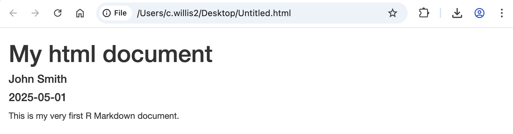

# Introduction to Markdown in R

## Components of an R Markdown document: formatted plain text

Many of the features that you might implement in other text-based applications like Microsoft Word can also be easily implemented in R Markdown documents. This could range from basic alterations to text aesthetics, through to the addition of tables and images, or even the inclusion of hyperlinks.

### How is plain text added to an R Markdown document?

Adding text to an R Markdown document is as straightforward as typing what you want to write in any of the white space below the YAML header, for example:

```rmarkdown
---
title: "My html document"
author: "John Smith"
date: "`r Sys.Date()`"
output: html_document
---
This is my very first R Markdown document.
```

Any plain text that is written in the white space below the YAML header of the R Markdown file will then ultimately be included as normal text in the output document when the R Markdown file gets processed. In the case of the above example, the output would look like as follows (opened in Google Chrome):



### How can the aethetics of plain text be adjusted in R Markdown?
The aethetics of text written in an R Markdown document can be easily modified by applying the annotation syntax that underlies the Markdown language. This can include making headers, boldening and/or italicising text, and creating lists.

#### Adding headers:
In Markdown language, a line of plain text can be converted into a header by placing a `#` symbol at the start of that line. 
```rmarkdown
---
title: "My html document"
author: "John Smith"
date: "`r Sys.Date()`"
output: html_document
---
# This is my very first R Markdown document.
```

headers,
bold, italic, underline, colour, highlight
Lists
paragraphing

### TEXT BASED TABLES ###
Tables
Images
hyperlinks
bibliography?
paragraphing & line breaks
Note on underline and changing colour

visual items: tables, images


Many of the text formatting like in Microsoft Word, such as altering text appearance, including tables and images, and even embedding hyperlinks can be straightforwardly applied in R Markdown documents

can be straighforwardly applied in R Markdown documents
