# Introduction to Markdown in R

## Components of an R Markdown document: formatted plain text

Many of the features that you might implement in other text-based applications like Microsoft Word can also be easily implemented in R Markdown documents. This could range from basic alterations to text aesthetics, through to the addition of tables and images, or even the inclusion of hyperlinks.

### How is plain text added to an R Markdown document?

Adding text to an R Markdown document is as straightforward as typing what you want to write in any of the white space below the YAML header, for example:

```rmarkdown
---
title: "My html document"
author: "John Smith"
date: "`r Sys.Date()`"
output: html_document
---
Background:
This is my very first R Markdown document.
```

Any plain text that is written in the white space below the YAML header of the R Markdown file will then ultimately be included as normal text in the output document when the R Markdown file gets processed. In the case of the above example, the output would look like as follows:

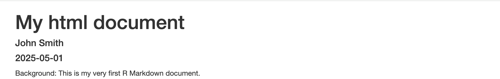

Notice how, despite typing the text over two lines in R Markdown itself, it all falls on the same line in the HTML output. To display unformatted plain text in a `.Rmd` file on seperate lines in the processed output, you can use the Markdown line break syntax `<br>` (only works for HTML), end the above of the lines with two spaces, or (for a slightly larger gap) simply include a blank line (both the latter work for HTML, Word and PDF outputs). For example: 

```rmarkdown
---
title: "My html document"
author: "John Smith"
date: "`r Sys.Date()`"
output: html_document
---
Background: <br>
This is my very first R Markdown document (Markdown line break syntax).

Background:  
This is my very first R Markdown document (two spaces at end of the above line).

Background:

This is my very first R Markdown document (blank line in-between).

```

When processed, the above would then produce a HTML output looking like the following:

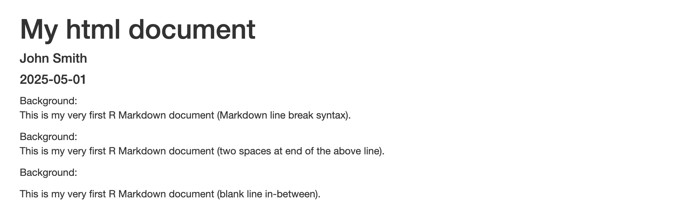

Line break syntax can even be used to split a single sentence over multiple lines. For example:

```rmarkdown
---
title: "My html document"
author: "John Smith"
date: "`r Sys.Date()`"
output: html_document
---
Background: <br>
This is my very first <br>
R Markdown document.

```

Here, the sentence "This is my very first R Markdown document." will then appear over two lines in the output.

### How can the aethetics of plain text be adjusted in R Markdown?

The aethetics of text written in an R Markdown document can be easily modified by applying the annotation syntax that underlies the Markdown language. This can include making headers, boldening and/or italicising text, and creating lists.

#### Adding headers:

In Markdown language, a line of plain text can be converted into a header by placing a `#` symbol at the start of that line (making sure there is a space between the `#` symbol and the first letter of text). For example: 

```rmarkdown
---
title: "My html document"
author: "John Smith"
date: "`r Sys.Date()`"
output: html_document
---
# Background:
This is my very first R Markdown document.
```

Notice how the plain text on the line starting with the `#` now appears blue. This is an example of annotation syntax highlighting in R Markdown, which usefully makes the specific bits of text being formatted stand out. Processing the above in an R Markdown file would then generate a HTML output that displays like the following:

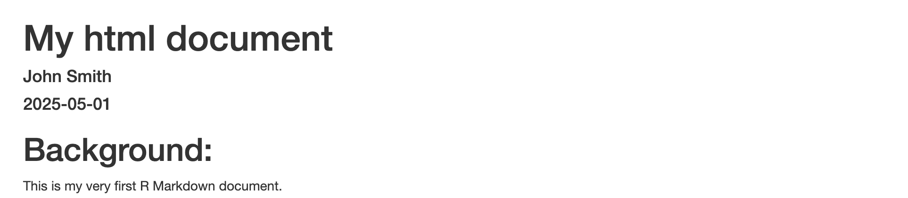

In the above case we used a single `#` symbol to induce a header. Nevertheless, it is also possible to invoke sub-headings by adding multiple `#` symbols at the start of the required text. The number of `#` symbols used at the start of a given line then determines the level of the heading. For example:

```rmarkdown
---
title: "My html document"
author: "John Smith"
date: "`r Sys.Date()`"
output: html_document
---
# Background:
This is my very first R Markdown document.

## Section 1
Some text.

### Subsection 1
Some more text.

## Section 2
Some text.

### Subsection 1
Some more text.

### Subsection 2
Even more text.

```

The HTML output generated upon processing the above in an R Markdown file would subsequently look like:

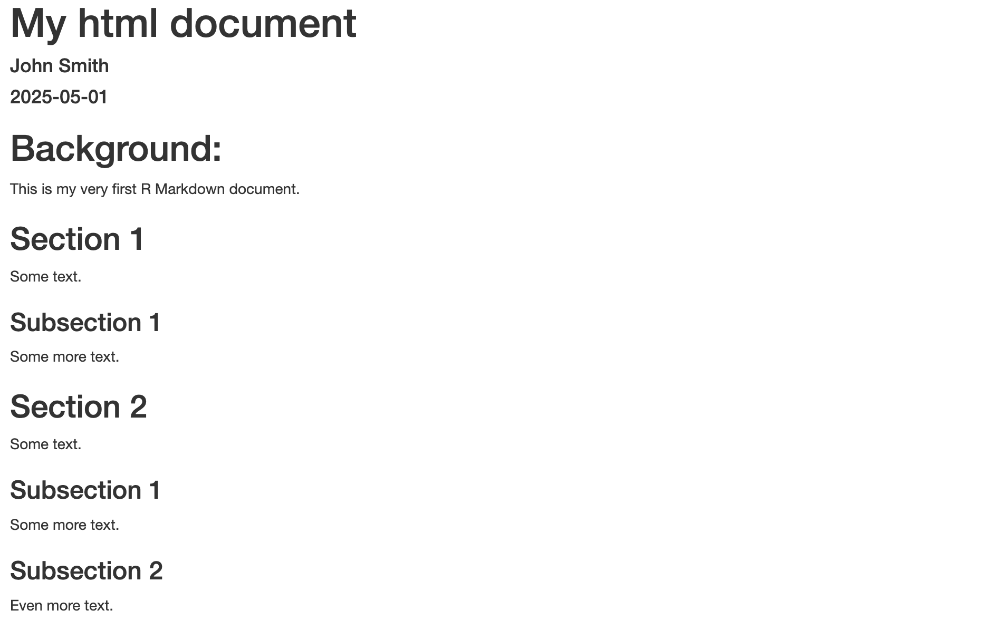

The lower the level of the heading, the smaller the header text is outputted. Also notice how unlike the case for unformatted plain text, when a header is invoked in R Markdown, the subsequent line is automatically treated as a new line in the output when the `.Rmd` file is processed. Further, if the table of contents (`TOC`) option is set to `TRUE` in the YAML header, the formatted text headers and subheaders will form the resultant table of contents in the output.

#### Font formatting:

Aside from the `#` symbol for invoking headers, dedicated Markdown annotation syntax also exists for boldening and/or italicising text (*via* the `*` symbol), as well as striking through text (*via* the `~` symbol), as follows:

```rmarkdown
---
title: "My html document"
author: "John Smith"
date: "`r Sys.Date()`"
output: html_document
---

*italic text*

**bold text**

***bold and italic text***

~~strike-through text~~

# *Italic header*

```

When processed, the above R Markdown syntax would generate a HTML output looking like the below:

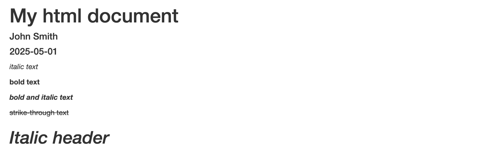

#### Lists:

Various types of lists can also be implemented in R Markdown. Unordered (bullet point) lists can be produced by starting a line with the `-` symbol, with it further possible to introduce sub-listing by indenting the `-` symbol with at least two spaces. For example:

```rmarkdown
---
title: "My html document"
author: "John Smith"
date: "`r Sys.Date()`"
output: html_document
---

- list element 1
- list element 2
  - list element 2, sub-element 1
  - list element 2, sub-element 2
- list element 3

```

The resultant HTML output generated upon processing the above in an R Markdown file would subsequently look like:

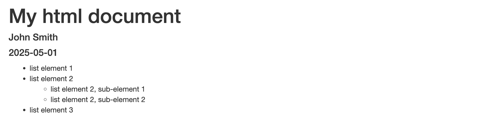

Ordered (numerical) lists just as easily implemented by starting a given line with a number joined to a `.` symbol. Ordered sublists are also possible using this convention, but require at least four spaces to invoke the indentation:

```rmarkdown
---
title: "My html document"
author: "John Smith"
date: "`r Sys.Date()`"
output: html_document
---

1. list element 1
2. list element 2
    1. list element 2, sub-element 1
    2. list element 2, sub-element 2
3. list element 3

```

The above, when processed, will generate an output that looks like:

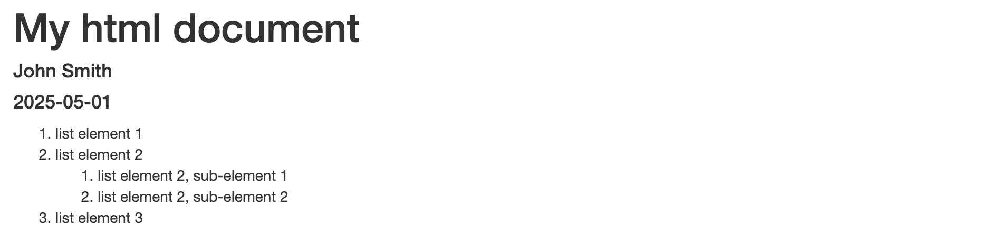

Finally, it is possible to create task lists in R Markdown by implementing the following Markdown annotation syntax:

```rmarkdown
---
title: "My html document"
author: "John Smith"
date: "`r Sys.Date()`"
output: html_document
---

- [ ] task 1
- [X] task 2

```

In the resultant HTML output, this would display as the following:

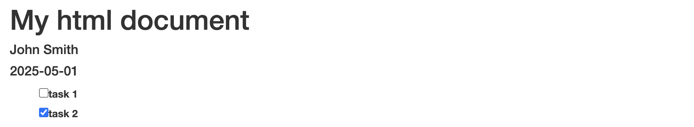

### How can tables and images be embedded in an R Markdown document?

When creating an R Markdown document, it is likely that the output will include tables and figures that are directly generated by the R code that is included within the document. However, it is also possible to manually create text-based tables and integrate in external image files.

#### Embedding text-based tables:

Tables can be manually created in R Markdown by using a mix of the `|`, `-` and `:` symbols. The `|` symbol is used to demarcate columns, while the `-` symbol is used to seperate table headers from normal table text. For example:

```rmarkdown
---
title: "My html document"
author: "John Smith"
date: "`r Sys.Date()`"
output: html_document
---

| Header 1 | Header 2 | Header 3 |
| -------- | -------- | -------- |
| Text     | Text     | Text     |
| Text     | Text     | Text     |

```

When processed, the above R Markdown syntax would generate a HTML output that looks like the following:

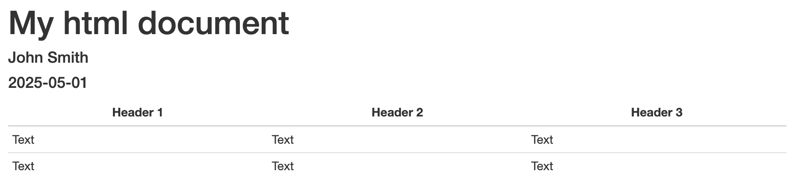

The `:` symbol then enables for control of text justification (left, centre or right) in the table:

```rmarkdown
---
title: "My html document"
author: "John Smith"
date: "`r Sys.Date()`"
output: html_document
---

| Header 1 | Header 2 | Header 3 |
| :------- | :------: | -------: |
| Left     | Centre   | Right    |
| Aligned  | Aligned  | Aligned  |
| Text     | Text     | Text     |

```

The HTML output generated upon processing the above would subsequently look like:

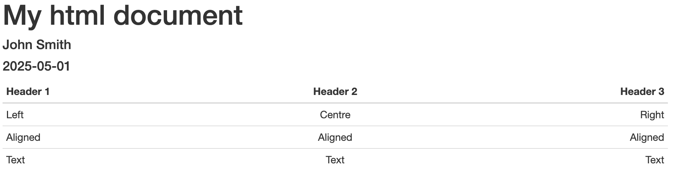

#### Embedding external images:

Both web-based images and locally saved images can be embedded into an R Markdown document. The Markdown annotation for embedding a web-based image is ``, where a short description of the image is given in `[ ]` brackets for screen readers, and the image URL given in the `( )` brackets. For example:

```rmarkdown
---
title: "My html document"
author: "John Smith"
date: "`r Sys.Date()`"
output: html_document
---

The below figure illustrates how muscle strength changes with ageing: <br>


```

The HTML output when the above is processed within an R Markdown document is then as follows:

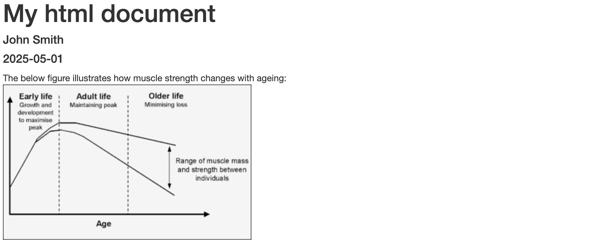

It is worth noting in the above example, the `<br>` notation was used to make the image appear below the preceding line of unformatted plain text. If you were to instead leave a blank line between the unformatted text and the annotation syntax for embedding the image, then the brief textual description contained within the `[ ]` brackets will show as an image caption in the resultant output. 

Locally saved images are also embedded into R Markdown documents using the same Markdown annotation syntax as for web-based images, but by instead feeding the path to the image's location on the computer. For example, if the above image were saved in the downloads folder of a local user's profile, the annotation syntax would be:

```rmarkdown
---
title: "My html document"
author: "John Smith"
date: "`r Sys.Date()`"
output: html_document
---

The below figure illustrates how  muscle mass and strength change with ageing: <br>


```

### How are hyperlinks embedded into R Markdown documents?

Clickable hyperlinks can be embeded into R Markdown documents using similar Markdown annotation syntax as is used for embedding images, but without a `!` symbol prior to the `[ ]` brackets. Moreover, the plain text that is entered within the `[ ]` will be the text that acts as a clickable hyperlink in the output. For example:

```rmarkdown
---
title: "My html document"
author: "John Smith"
date: "`r Sys.Date()`"
output: html_document
---

The below figure illustrates how muscle mass and strength change with ageing: <br>


An illustration of how muscle mass and strength change with ageing can he found [here](https://ars.els-cdn.com/content/image/1-s2.0-S1279770723023655-gr1.jpg).

```

The HTML output generated when the above R Markdown syntax is processed would look like the following:

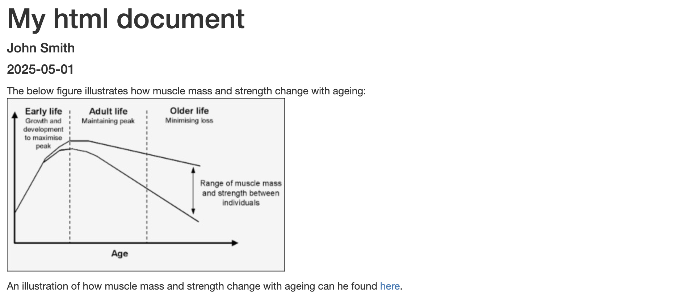

### How are references embedded into R Markdown documents?

If you are using R Markdown to generate complete reports, it likely that you will intend to include references to literature where necessary. To embed references into R Markdown, it is first required to construct a bibliography file in BibTeX  (`.bib`) format that contains the references. BibTeX files can be created using any text editor by saving the file the file with a `.bib` extension. References within BibTeX files are formatted as follows:

```bibtex
@article{distefano2018,
  title={Effects of exercise and aging on skeletal muscle},
  author={Distefano, Giovanna and Goodpaster, Bret H},
  journal={Cold Spring Harbor perspectives in medicine},
  volume={8},
  number={3},
  pages={a029785},
  year={2018},
  publisher={Cold Spring Harbor Laboratory Press}
}
```

You can get the metadata for a research output in the above format by locating its Google Scholar entry, clicking `Cite` and selecting `BibTeX`. This can then be copy and pasted into your own BibTex file. 

With your BibTeX file saved in the same directory as your `.Rmd` file, you can then embed references into your R Markdown document by pointing to the `.bib` file in the YAML header using the `bibliography` YAML key, and using the citation key syntax in-text to pull a specific reference from the `.bib` file. For example:

```rmarkdown
---
title: "My html document"
author: "John Smith"
date: "`r Sys.Date()`"
output: html_document
bibliography: myreferences.bib
---

Muscle mass declines at a rate of approximately 10% per decade after the age of 30 [@distefano2018].

#### References:
```

In the resultant HTML output, this would display as the following:

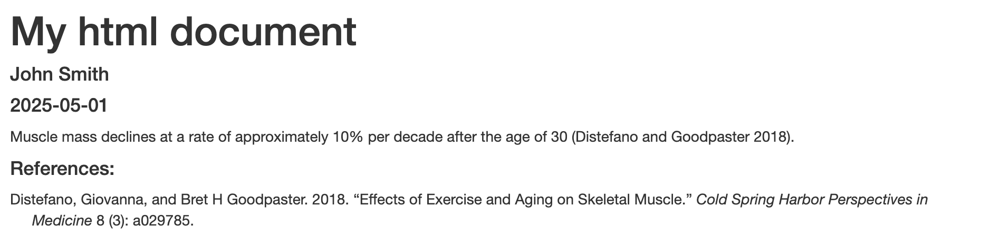

By default, the Chicago author-date format is applied in R Markdown when embedding references. To use a different referencing style, you will need to download (e.g., from the Zotero Style repository) the associated `.csl` file for that style and then as sign it to the value of the `.csl` key in the YAML header.

### Can Markdown annotation symbols be displayed as normal characters?
Sometimes you might need to display special characters (like `*`, `_`, or `#`) in your R Markdown text without them being interpreted as annotation symbols. To do this, you can escape the character by placing a backslash (\) before it. For example:

```rmarkdown
---
title: "My html document"
author: "John Smith"
date: "`r Sys.Date()`"
output: html_document
---

- List item 1

\- display symbol normally

```

The above will translate into the below utput HTML when processed:

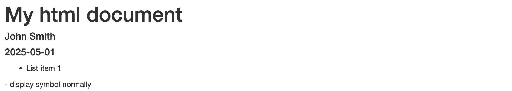

### Task
Below is a HTML output generated using R Markdown. Try to reproduce this in your open R Markdown document. You can check the formatting effects you apply in real time by toggling from `Source` view to `Visual` view in the top left corner of the RStudio script pane. The Google Scholar entry for the utilised journal article can be found [here](https://scholar.google.com/scholar?hl=en&as_sdt=0%2C5&q=Integrative+effects+of+resistance+training+and+endurance+training+on+mitochondrial+remodeling+in+skeletal+muscle&btnG=). You will need to create a `.bib` file containing the reference and also obtain the URL for the image directly from the journal artical webpage.


