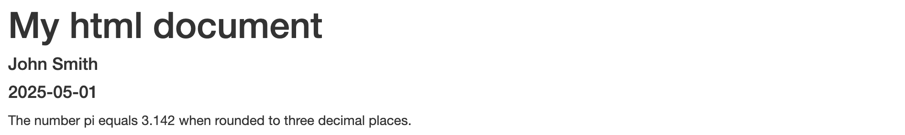
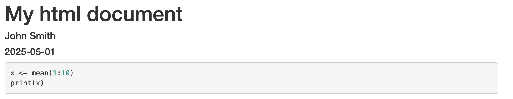

# Introduction to Markdown in R

## Components of an R Markdown document: embedded code

As mentioned earlier in this workshop, one of the primary benefits of R Markdown is the ability to integrate formatted plain text with R code and its outputs into a single dynamic document. Code can be embedded into R Markdown documents in two different forms:

1. In-line code
2. Code chunks

### How is in-line code embedded into an R Markdown document?

In-line code refers to snippets of code that are embedded within the plain text element of the R Markdown document. This can be helpful for when results or values need to be dynamically inserted without breaking the textual flow. The Markdown syntax for adding in-line R code in R Markdown is `` `r <your code>` ``, for example:

``` rmarkdown
---
title: "My html document"
author: "John Smith"
date: "`r Sys.Date()`"
output: html_document
---

The number pi equals `r round(x = pi, digits = 3)` when rounded to three decimal places.

```

Whenever a `.Rmd` file with in-line code is processed, the code gets evaluated, and the result is displayed in place of the code within the output. For the above example, the resultant HTML output would look like:



### How are code chunks embedded into an R Markdown document?

Code chunks are more lengthly blocks of standalone code that are better suited for use when running more detailed code, performing data analysis, and generating plots, etc. Most of the code that you would normally write in an R script will likely be best placed in code chunks. The syntax for embedding a code chunk into an R Markdown document is:

```` rmarkdown
``` {r}

```
````

Here, the R code chunk is initiated by starting a new line with `` ```{r} ``. R code can then be typed on the line(s) below this. Once all R code for that chunk has been written, the code chunk is ended by entering `` ``` `` on another new line. A properly embedded code chunk will show in R Markdown as having a solid grey background. Code chunks can be inserted into an R Markdown document *via* any of the following ways:

- Manually typing the code chunk syntax
- Using the keyboard shortcut `Ctrl + Alt + I` (or `Cmd + Option + I` on a Mac)
- Clicking the  button in RStudio and then selecting 

By default, when a `.Rmd` file gets processed, code chunks are evaluated and displayed alongside their results in the final output document. This behaviour can, however, be controlled *via* optional arguments definable within the `{r}` part of the code chunk. Some important custom options for code chunks in R Markdown are:

| Argument  | Description | Default value |
| :-------: | :---------- | :-----------: |
| `include` | Controls whether both the code and its results are included in the output. Code chunk will still be ran regardless. | `TRUE`        |
| `eval`    | Controls whether the code chunk is ran when the R Markdown file is processed. | `TRUE`        |
| `echo`    | Controls whether the code chunk is shown in the output.  | `TRUE`        |
| `message` | Controls whether messages generated when the code chunk is ran are shown in the output. | `TRUE`        |
| `warning` | Controls whether warnings generated when the code chunk is ran are shown in the output. | `TRUE`        |
| `error`   | Controls whether to proceed with generating a final output if an error is produced while the code chunk is processed. | `FALSE`       |
| `tidy`    | Controls whether code should appear in output exactly as written, or reformatted to display more tidily. | `FALSE`       |

The `echo` and `eval` arguments are perhaps two of the most commonly applied optional arguments for controlling the behaviour of code chunks. Using `eval = TRUE` and `echo = TRUE` (as default) will display both the code chunk and its result in the output. For example:

```` rmarkdown
``` {r eval = TRUE, echo = TRUE}
x <- mean(1:10)
print(x)
```
````

Will display in a HTML output as:


Using `eval = TRUE` and `echo = FALSE` will run the code chunk when the R Markdown file is processed, but only show the result of the code chunk in the final output. For the above example, this would display in a HTML output as:


Just having the result of a code chunk in the output but not the code itself is particularly useful when wanting to display figures produced using R code. Nevertheless, it can also be helpful sometimes to display the contents of code chunk in the output but not have it ran when the `.Rmd` file is processed, for example when drafting and debugging code, or showing example code without running it. In which case, the combination of `eval = FALSE` and `echo = TRUE` can be used. For the above example, this would display in a HTML output as:



Multiple code chunks can be embedded into a single R Markdown document, and it is good practice to partition your whole code into smaller, sensible code chunks that fit in and round descriptive formatted plain text to improve readability. It is also possible to run code chunks in real time within an R Markdown document itself. For a given code chunk in a `.Rmd` file, clicking  will run all code chunks above it in real time, while clicking  will run that code chunk itself in real time. This is helpful when dynamically trialing and testing code while you write it into the R Markdown document. Note that if a code chunk depends on an output generated by any code chunk above it, the depending code chunk(s) above will need to be ran first.

### Task

Since the last task, some further content has been added to the "Phenotypic differences" sub-section of the practice R Markdown file (HTML output given below). This includes:

- A code chunk to simulate an example plot of how muscle mass changes over time in response to 12 weeks of resistance *versus* endurance training
- A sentence above the code chunk in formatted plain text that introduces the plot
- A sentence below the code chunk that gives the final amount of muscle mass change *per* exercise type, with the values generated *via* in-line R code using the simulated data.

Try to implement this new content in your own R Markdown file.

#### *Task HTML output:*


