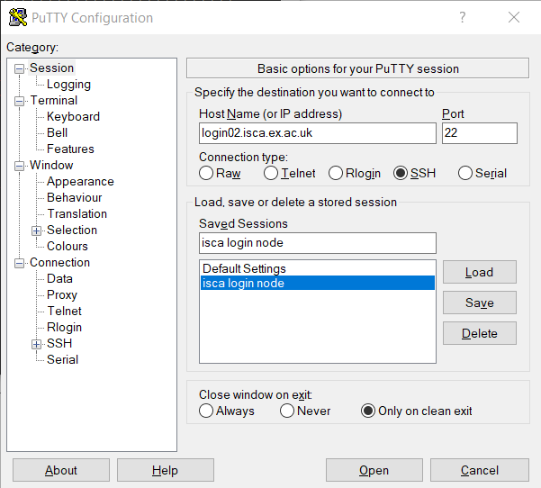

# How do I connect to a HPC Cluster?
## Learning Objectives

At the end of this lesson you will be able to:

- Connect to the ISCA HPC system with your university credentials
- Create an ssh `config` file for easier access via the command line

## Via the Command Line

### Checking 
The most common way to connect to a remove HPC server is via a command line shell program `ssh`. This application uses the Secure SHell protocol (or SSH) to open an encrypted network connection between two machines, allowing you to send & receive text and data without having to worry about prying eyes. It should be available in all terminal apps (Windows, Linux, & Mac), but to doublecheck type `ssh` into your terminal of choice and press enter. If it is installed properly, you should get output like that below.

~~~
you@laptop:~$ ssh
~~~
{: .language-bash}

~~~
usage: ssh [-46AaCfGgKkMNnqsTtVvXxYy] [-B bind_interface]
           [-b bind_address] [-c cipher_spec] [-D [bind_address:]port]
           [-E log_file] [-e escape_char] [-F configfile] [-I pkcs11]
           [-i identity_file] [-J [user@]host[:port]] [-L address]
           [-l login_name] [-m mac_spec] [-O ctl_cmd] [-o option] [-p port]
           [-Q query_option] [-R address] [-S ctl_path] [-W host:port]
           [-w local_tun[:remote_tun]] destination [command [argument ...]]
~~~
{: .output}

If you do *not* get this output, please let the instructor know. But don't worry, there are other means of connecting to the system and well will cover those in a moment.

### Logging In

Assuming you were given access to the system by an administrator, you should be able to login with your standard university credentials. The syntax for logging into a machine with `ssh` is 
~~~
you@laptop:~$ ssh username@hostname
~~~
{: .language-bash}

where `username` is your standard login and the `hostname` is address of the server you wish to log into. For this workshop the `hostname` will be `login02.isca.ex.ac.uk`. Don't forget the **@** symbol, like you would see in an email address. You will then be prompted for your university password.

### First Time Warning
An important security warning will occur whenever you attempt to log into another machine for the first time. 
~~~
The authenticity of host 'login02.isca.ex.ac.uk (144.173.114.23)' can't be established.
ED25519 key fingerprint is SHA256:rPqlD8myIfJUQBINKPYCp47oIQm3sGVMUPSAWT26E/M.
ECDSA key fingerprint is SHA256:ah29tkixxl7NW/zdJM6TSbASY3UyLsKZEKUMMZSD3X0.
This key is not known by any other names
Are you sure you want to continue connecting (yes/no/[fingerprint])?

~~~
{: .language-bash}

Make sure that the IP address (i.e. `144.173.114.23`) and the appropriate key fingerprint that you get match the information found above. Any subsequent time you log into that same server, you should **not** see this message, as this server's fingerprint is saved in a list of `known_hosts`. If you do get this message while connecting to a server you have logged into previously, please contact a system administrator **immediately**.

### Config File

Remembering the long hostnames can be a pain. We can create a config file that allows us to use shorter and more memorable ones for machines we use regularly using an ssh `config` file. For those using a Unix terminal, the two commands below will create a file with access restricted to just the current user.
~~~
touch ~/.ssh/config
chmod 600 ~/.ssh/config
~~~
{: .language-bash}

Open up that file in your preferred text editor and copy the following example into it. **Remember** to swap your specific `username` for the placeholder.
~~~
# Configuration file for simplifying SSH logins
Host login.isca
    User your_username
    Hostname login02.isca.ex.ac.uk
~~~
{: .language-bash}

Now you can log in with a far shorter and easier to remember command. But you still will be prompted for your password.
~~~
you@laptop:~$ ssh login.isca
~~~
{: .language-bash}

## Graphical Interfaces

An alternative means of connecting to a remote host server is via an application like the [Putty](https://putty.org/) SSH Client. It provides nice app-based way to save host connection configs so one need not input them again each time. Like the command line option, if you haven't logged in before, it will raise a *warning* message.

You will be prompted in a new terminal session for your username and password.

