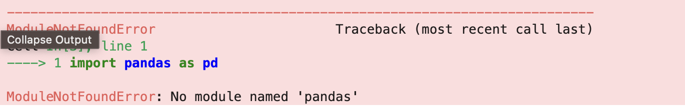

# How to Embed Python Code in Markdown

## Learning Objectives

By the end of this section, you will be able to:

- Understand how to embed Python code within a Markdown document.
- Learn how to use Jupyter Notebooks to create dynamic and interactive documents.
- Explore techniques for running and displaying Python code outputs directly in Markdown.

## Key Points

- In Jupyter Notebooks, you can mix Markdown (for text) and code (for Python).
- This lets you create readable documents with explanations, code, and output all in one place.

## 1. Create a Jupyter Notebook file

1. In the JupyterLab interface, click the File menu at the top left.
2. Choose `New > Notebook` from the drop-down.
3. Select `Python 3` as the kernel (this allows you to run Python code in the notebook).

## 2. Jupyter Notebook Basics
A Jupyter Notebook consists of different types of cells that you can use to create interactive documents. The two most commonly used cell types are:
- Markdown cells
- Code cells. 

### Add Markdown

You can write Markdown in a cell and then render it by executing the cell.

1. Click on a cell to select it.
2. Ensure the cell is set to `Markdown`:
    1. Look at the toolbar at the top of the JupyterLab interface.
    2. In the dropdown menu, you’ll see the option to select the `Cell Type`. If the cell is not already set to `Markdown`, click the dropdown and select `Markdown`.
    3. Alternatively, you can simply press the `M` key when the cell is selected, which will automatically set the cell to `Markdown`.
3. Enter your text and use Markdown syntax for formatting.

```
## Results
```
After entering the code, you can execute the cell by pressing `Shift + Enter` or the single arrow at the top. The output will be displayed below the cell.

### Add Python

1. Click on the cell below to select it
2. Ensure the cell is set to `Code`:
    1. Look at the toolbar at the top of the JupyterLab interface.
    2. In the dropdown menu, you’ll see the option to select the `Cell Type`. If the cell is not already set to `Code`, click the dropdown and select `Code`.
    3. Alternatively, you can simply press the `Y` key when the cell is selected, which will automatically set the cell to Code.
3. Type a Python command, such as: 

```
4 * 4
```

After entering the code, you can execute the cell by pressing `Shift + Enter` or the single arrow at the top. The output will be displayed below the cell.

Every time code is executed in a code cell, the output will be shown directly below the cell.

Outputs can include:
- Text (e.g., print statements)
- Plots (using libraries like matplotlib or seaborn)
- Tables (using pandas DataFrames)

You can edit an already executed cell, double-click the cell or press `Enter` while it's selected.
  
**Remember: if the code is changed, the output will update instantly when the cell is re-executed.**


## 3. Packages

Importing packages into a Jupyter notebook is a crucial step, exactly like importing them in a regular Python `.py` file.  For example: 

```
import pandas as pd
```

Importing packages will give you access to external libraries like pandas, numpy or matplotlib. You may see an error when importing a package, this usually means the package isn't installed yet. 

### Error Package Not Installed



### Solution
- Install package
    - in Jupyter Notebook: `!pip install pandas`
    - in a terminal: `pip install pandas`

## 4. Import Data

Now, you'll learn how to load and explore real data using pandas DataFrames, an essential skill when working with dynamic documents in Jupyter Notebooks.

We’ll be using the Titanic dataset, a classic dataset that contains information about passengers on the Titanic, such as age, class, sex, and whether they survived. This dataset is built into the `seaborn` library, so there’s no need to download anything manually.

We first want to import the packages and load the dataset. A Jupyter notebook cell can take multiple lines so we will put the following in one cell:
```
import seaborn as sns
import pandas as pd

df = sns.load_dataset("titanic")
```

Don't forget to install the packages!

This creates a pandas data frame named `df` that we’ll use for the rest of the lesson.

Let's inspect the data!

Let's start by viewing the first 5 rows:
```
df.head()
```
Once you have executed the cell (`Shift + Enter`), you will see the output table below your python command.


Similarly, we can get a summary of columns and data types:
```
df.info()
```

Finally, we'll see the basic stats for the numeric columns:
```  
df.describe()
```

To load a dataset from your local machine (e.g. a `.csv` file), you can use `pandas.read_csv()`. Here’s an example:

```
import pandas as pd

df = pd.read_csv("path/to/data.csv")
```
You can then use `df.head()` to preview the dataset, just as you would with built-in data. 

For this lesson, we’ll continue using a dataset provided by the `seaborn` library to keep things simple and avoid the need for local file uploads.

## 5. Graphs

In this section, you'll learn how to create simple, static graphs to explore and communicate insights from your data. We'll use the Titanic dataset and Matplotlib. We have already imported the dataset so now we just need to import Matplotlib.

```
import matplotlib.pyplot as plt
```

### Histogram
We can view Age Distribution using a histogram. 

```
plt.hist(df["age"].dropna(), bins=30)
plt.title("Age Distribution")
plt.xlabel("Age")
plt.ylabel("Frequency")
plt.show()
```

### Barchart
We can analyse survival counts using a barchart.

```
survival_counts = df["survived"].value_counts()

plt.bar(survival_counts.index.astype(str), survival_counts.values)
plt.title("Survival Counts")
plt.xlabel("Survived (0 = No, 1 = Yes)")
plt.ylabel("Number of Passengers")
plt.show()
```

Remember!
You can always tweak plots using `matplotlib` functions after creating a `seaborn` plot, such as adding labels, titles, or rotating tick labels for clarity.

## 5. Beyond Static Graphs

While static graphs created with Matplotlib or Seaborn are excellent for basic visualisation, they can be limited when you want to explore data more deeply or share your findings in an engaging way.

Interactive graphs allow users to:

- Zoom in and out to examine details closely.
- Hover over points to see exact values or additional information.
- Pan around the plot dynamically.
- Filter or select data on the fly.
- These features make your analysis more flexible and insightful, especially for large or complex datasets.

There is a very useful interactive ploting library called `plotly` which can help with this.
- What it is: A powerful library for interactive, web-based visualisations.
- Key features: Zooming, panning, tooltips on hover, multiple chart types, easy sharing as HTML.
- Example: Creating an interactive scatter plot where users can explore data points by zooming or hovering.

Here is an example using plotly to plot a scatter graph of Fare vs Age.  

```
import plotly.express as px

fig = px.scatter(df, x="age", y="fare", color="class",
                 hover_data=["sex", "survived"],
                 title="Interactive Scatter Plot of Fare vs Age")
fig.show()
```

Once you have executed this in a cell and the graph is displayed, have a play with the interactive features. You'll be able to toggle the key on and off, select data points for more information, and zoom in and out. A tool bar appears when you hover over the graph which aids interaction. 

Embedding Python in Markdown transforms static documents into interactive, dynamic tools that enhance data analysis, storytelling, and reproducibility.

## Note on Sensitive Data
Before sharing or publishing your notebooks, ensure they do not contain any sensitive or restricted information. This includes:

- Personal identifiers (e.g. names, addresses, NHS numbers).

- Confidential research data.
  - For example, data from resources like the UK Biobank is highly restricted and governed by strict usage agreements, you must:
    - Not share raw data outside approved channels.
    - Avoid including any identifying variables in notebooks.
    - Remove or anonymise data used in code examples.
    - Use mock data or publicly available datasets for demonstrations, and always follow your institution’s or organisation’s data protection and ethical guidelines.


