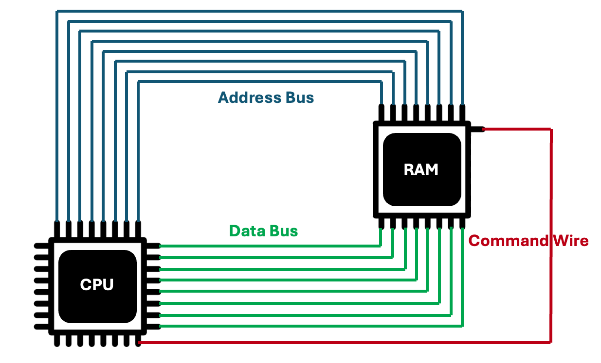
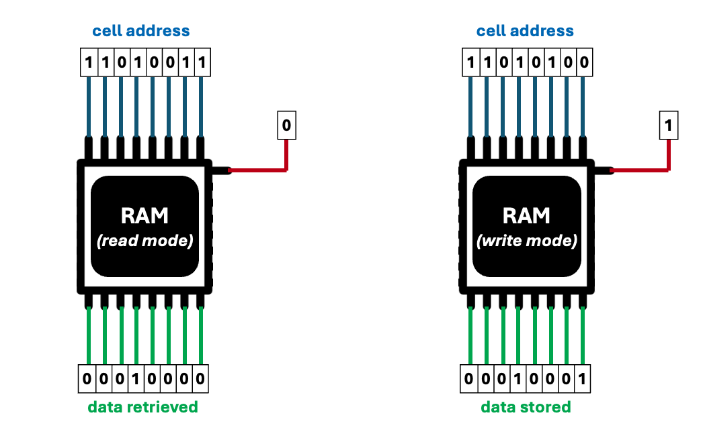
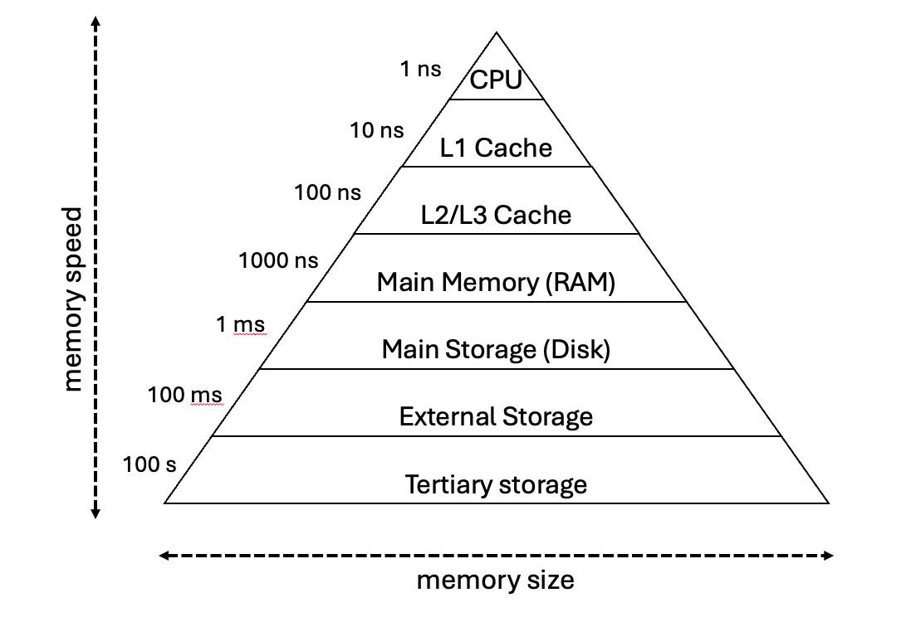
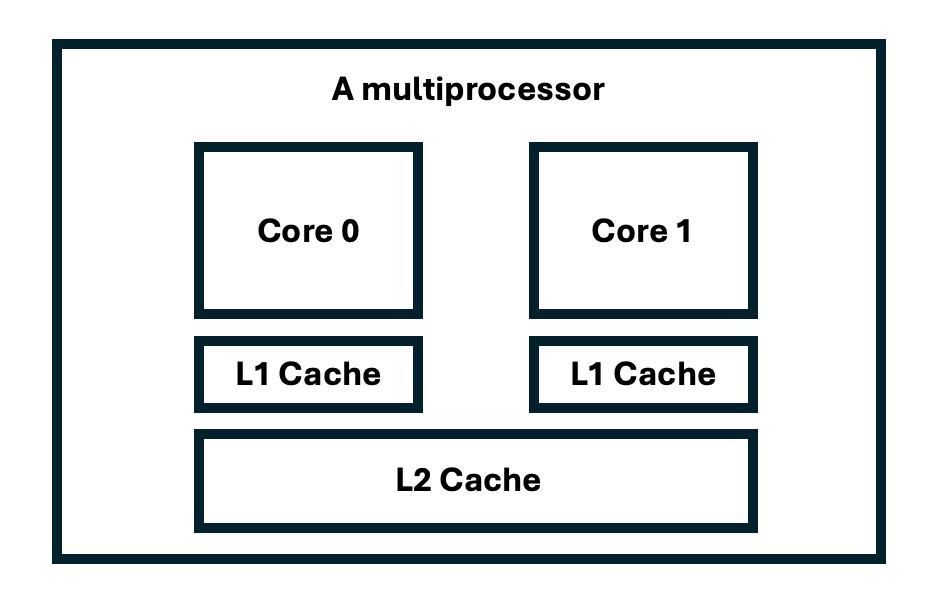

# Parallel computing

This course is a very gentle introduction to parallel computing, using the Python language. Before diving directly into coding, one first has to have some understanding of modern computing architecture. For this course we will focus on the CPU architecture. The assumption will be that learners will have very rudimentary or no knowledge of modern CPU architectures, and we will give a fairly high level view description of this architecture here. 

Once this basic foundation of modern architectures has been laid, we will dive into the some coding examples using Python's `multithreading` and `multiprocessing` modules which are suitable to run on single CPUs. Following this we will use the `mpi2py` library illustrating the MPI message passing model for writing code that runs on multiple CPU nodes, like one would find in a HPC machine for instance. All coding exercises will be demo'd using Jupyter notebooks.

## The modern CPU architecture

A computer is a machine that follows instructions to manipulate data. Figure 1 shows two very important components, a processor and memory. The memory, or RAM (Random Access Memory), is where we write the instructions. It also stores the data to operate on. The processor, or CPU (Central Processing Unit), gets instructions and data from the memory and performs the required calculations. 

### The RAM

Memory (or RAM) is divided into many cells. Each cell stores a tiny amount of data, and each cell has an address. Reading and writing data in memory is done through operations that affect one cell at a time. To read/write to a specific memory cell. we muct communicate its numerical address. RAM is an electrical component, we transmit cell addresses via wires. Each wire transmit a binary digit (0 or 1). Wires are set at a higher voltage for the "1" signal or lower voltage for the "0" signal. Figure 2 schemetic illustrates all of this.

There are two things the memory can do with a given's cell's address; either gets its values or store a new value. The memory has a special input wire for setting its operational mode.

Usually each memory cell stores an 8-digit binary number, which is called a byte. In "read" mode, the memory retrieves the byte stored in a cell, and outputs it in eight data-transmitting wires.

When the memory is in "write" mode, it gets a byte from these wires and writes it to the informed cell. A group of wires used for transmitting the same data is a calles a bus. The eight wires used to transmit address form the address bus. The other eight wires used to transmit data to and form cells for the data bus. The adress bus is unidirectional (only used by memory to recieve data). The data bus is bi-directional (used ot send and receive data).

In any computer the CPU and RAM are constantly exchanging data. The CPU keeps fetching instructions and data from memory, and occasionally stores outputs and partial calculations in memory.

### The CPU - a high level view

The CPU has some internal memory cells called registers. It can perform simple mathematical operations with binary numbers stored in these registers, and do so at an extremely fast rate. The CPU can also move data between RAM and its registers. Modern CPUs also have additional internal data stores, called caches, but more about that later.

Typical operations a CPU can perform could be for example:

- Copy data from memory position #150 into register #2,
- Add the number in register #2 to the number in register #4.

The collection of all operations a CPU can perform is called its instruction set. Each operation in the instruction set is an assigned number. Computer code is essentially a sequence of number representing CPU operations. These operations are stored as numbers in the RAM. Input/output data, partially complete calculations, and computer code are all mixed up in the RAM.

The very first CPUs had a small, yet sufficiently complete, instruction set. With advances in CPU manufacturing, CPUs kept on supporting more operations. The instruction set of modern CPUs is huge. As an aside note Alan Turing, the father of computing, discovered that simple machines can be powerful enougth to compute anything that is computable, given sufficient time. For a machine to have universal computing power, it must be able to follow a program containing instructions to:

- Read and write data in memory,
- Perform conditional branching: if a memory address has a given value, jump to another point in the program.

The CPU works in a never-ending loop, always fethcing and executing an instruction from memory. At the core of this cycle in the PC register, or Program Counter. Its a special register that containes the memory address of the next instruction to execute. The CPU will in a (nearly endless) loop:

- Fetch an instruction at the memory address given by the PC,
- Incrememnt the PC by 1,
- Execute the instruction, 
- Go back to step 1.

The CPU can perform conditional branching because it can do things like: "set PC to address #231 if register #1 equals zero".

Arcade games in the 1980s, like Space Invaders became super popular. Space Invaders had about 3000 machine instructions. The CPUs these games were played on was equiped with a 2 MHz CPU. That is the CPU clock, i.e. the number of basic operations it can execute per second. Typically a machine instruction requires 5 to 10 basic operations to complete. An arcade game CPU ran hundreds of thousands of machine instructions every second.

Modern laptops and desktops have ~2 GHz CPUs, which can perform hundreds of millions of machine instructions every second. Many modern CPUs are multi-core. A quad-core 2 GHz CPU can theoretically perform close to a billion machine instructions per second.

Not all CPUs have the same instruction set. The x86 architecture is pretty standard in most personal computers. Phones and tablets have CPUs with different achitectures that ar emore energy efficient. A different CPU architecture, means a different instruction set. So numbers that translate as instructions for your laptop CPU don't represent valid instructions for the CPU on your cell phone for instance. It is also the reason why you cannot play a PlayStation CD directly on you laptop computer. There are special programs called emulators, which one can use to get around this issue. Emulators are computationally more expensive to run because the instructions needs to be first decoded by the emulator and then executed within the emulated machine.

The first CPU, called Intel 4004, was built on a 4-bit architecture. This means it could operate (sum, compare, move) binary number of up to 4 digits in a single machine instruction. The 4004 had data and address buses with only four wires. Technological progress over time led to 8-bit CPUs followed by 16-bit and then 32-bit CPUs which thus had registers that could hold 32-bit numbers. These larger registers mean larer data and address buses. An address bus with 32 wires allows addressing 2^32 bytes (4 GB) of memory (remember each address location in RAM correspond to 1 byte of data).

Over time computer programs became more complex, and started using more RAM. Addressing over 4 GB of memory with addresses that fit only in 32-bit registers are tricky. Modern day CPUs have 64-bit architectures. Such CPUs can work with extremely large numbers in their registers. These registers can store addresses in a enourmously large memory space: 2^64 bytes which is over 17 billion GB.

### Brief detour: Scripting and compiled languages.

Some computer languages are compiled directly into machine code that can run on the CPU, using a special piece of software called a compiler. Compilers are what allows us to write more succint programs using a syntax a human can easily understand. Programming languages which needs to directly compiled include languages like C, C++, Fortran, etc.

Other languages, called scripting languages, can be executed without direct compilation to machine code. These include languages like JavaScript, Ruby and Python.These language does not get executed directly by the CPU, but instead by an interpreter that must be installed on the machine running the code. The interpreter translates the developer's code to machine code in real time, which means runs much slower than pre-compiled code. On the upside a developer can always run the code immediately whitout waiting throught the compilation process.

### Memory hierachy

A computer works by having its CPU execute simple instructions. These instructions can only operate on data stored in the CPU registers. The storage space on CPU registers is usually limited to less than a thousand bytes. This means CPU registers constantly have to transfer data to and from the RAM. If the memory is slow, the CPU has to sit idle, waiting for the RAM to do its work. The time it takes for to read and write data is directly reflected in your computer's performance. Increasing your memory speed can boost your computer performance as much as increasing your CPU speed. Data in CPU registers is accessed near-instantly by the CPU, within just one cyle. The RAM is much much slower.

Technological advances has increased CPU speeds expotentially, but memory speeds has increased in a much slower rate. The performance gap between the CPU and RAM is known as the Processor-Memory Gap. Over time this gap has become relatively wider. In modern computers it takes about a thousand CPU cycles to get data from RAM, about ~1 micro second. Compare this with ~1 nano second a single modern CPU cycle takes.

Computer scientists has tried to find ways to reduce the number of RAM operations required by their computations. They noticed that:

- When a memory address is accessed, its very likely it will be accessed again soon. This is called temporal locality.
- When a memory address is accessed, its also likely that addresses adjacent to it going to be accessed soon during the program execution. This call spatial locality.

They reasoned it would be great to store these memory addresses in CPU registers in anticipation, which would would mean avoiding most of the expensive RAM operations. Unfortunaly engineers found a viable way to design CPU chips with enough internal registers to do this. However they found a way to exploit this temporal and spatial locality using a hierachy of memory storage locations close to the CPU called cache. This cache hierachy is now so important is takes up most of the silicon space inside a CPU chip.

#### L1 cache

It is possible to build extremely fast auxiliry memory integrated with the CPU, which is called L1 cache. Getting data from L1 cache is a just a little bit slower than getting it directly from the CPU registers, and its about a 100 times faster than getting it directly from RAM. With about 10 KB of L1 cache memory and smart utilization for temporal and spatial locality one can over half of RAM access calls can be fullfilled by the cache alone. Equipping a CPU with a L1 cache drastically reduces the time it has to wait for data.

#### L2 and L3 cache

Increasing the L1 cache would make fetching data from RAM even rarer. However growing the L1 cache without slowing it down is difficult. A better solution is to build an additional memory cacche called L2 cache. Allowing L2 cache to be slower, it can be much larger. A modern CPU will have about 200 KB of L2 cache. IT takes about 100 CPU cycles to get data from L2 cache into CPU registers, compared to about 10 CPU cycles for L1 cache.

Generally one would keep the very highly likely accessed address data copied in the L1 cache. Memory spaces with a high probability of being accesd are copied in the L2 cache. If a memory address is not copied in the L1 cache, the CPU can still try the L2 cache. Only if its neither will it access RAM. Many new CPUs also have L3 cache, larger but slower than L2 cache, but still faster than the RAM.

Figure 5 shows the different types of memory arranged in a hierarchy. As we go down the hierarchy, more memory space is available, but lower access speeds. RAM, and memory types higher the hierarchy is called primary memory - the CPU can directly access the data in these stores. Data stores lower in the hierarchy is called secondary memory - the CPU cannot access this data, it must be coppied into primary memory first. It is important to ensure all the data an programs a computer handles during typical activity can fit in its RAM. If not the computer constantly transfer data between the disk and the RAM, which is very very slow comparatively.

### The CPU - multiple cores   

As mentioned previously, modern CPUs can have multiple cores. Each core can operate in the manner previously discussed, executing instructions and access data from cache or RAM. However the layout of the cache hierachy around the cores is variable. Typically each core with have its own dedicated L1 and L2 cache, while the L3 cache can be shared between groups of cores in the CPU. One can also link multiple CPUs together (as is in an HPC compute node) so that the cores on the separate CPUs can share a common view of memory. 

For our purposes we will use an idealised model of a multicore CPU called a SMP (Symmetric Multi-Processor) - see Figure 5.

In this model all cores/processors can have access to the shared memory across the system. One should note that access to different memory stores on the chip/node can vary widely depending what the memory store is, and how close it is located to the core/processor. This is called a non-uniform memory architecture (NUMA). For our purposes we will ignore these effects - they are only important to consider when developing true high performance applications for a targeted architecture.

This rounds out our discussion on modern CPU architectures. The overview given here is just to give you enough background knowledge to engage with the content of the material in this course. Important other architectures we haven't touched on are SIMD (single instruction multiple data) vector units found in modern CPUs as well as GPUs (Graphic Processing Units). We'd encourage you to explore modern compute architecture on your own, as you progress in your parallel computing journey!

## Concurrency and parallelism

Concurrency refers to the ability of a program to manage multiple tasks at once, improving performance and responsiveness. The two types of concurrency models in Python we will be using during this course are multithreading and multiprocessing. Each of these offer unique benefits and trade-offs. Multithreading facilitate concurrency on a single core/processor, while multiprocessing allows for true parallelism using multiple CPU cores on a single CPU (node). For true HPC type applications running across multiple CPU nodes that don't share the same primary memory, we will delve into message passing via MPI using the mpi4py library.

In Python, the things that can occur simultaneously are sometimes called by different names, such as a thread, task or process. These terms are same if you view them from a high-level perspective. When diging into the details, they all represent slightly different things however. In this course we will generally use the term thread, but at times will switch to using the terms task or process to fit the particular context.

Threads refer to a sequence of instructions that run in a particular order. Each thread can be paused at certain points, and the CPU can then switch to process a different thread. The state of each thread is saved so it can be restored to run fron the correct instruction when the CPU switiches back to processing it.

As mentioned previously Python threads always run on a single core/processor, which mean they really only can run one at a time. The reason why this is so, is because of Python's GIL (Global Interpreter Lock) at the core of Python itself. In the latest versions of Python one can remove the GIL, but this is still very much in the experimental phase. Removing the GIL means one needs to carefully manage, in code, multiple threads' data access to Python objects and data structures. All of this means using Python's multithreading model (with the GIL in place) is only suitable for certain types of concurrency applications - more about this later. This is different from how multithreading models in other programming languages are defined, which is more similar to Python's multiprocessing model in a sense. In Python's multithreading model it is left up the operating system to manage switching between threads. 

True parallelism happens when multiple threads/processes/tasks run at exactly the same time, independently of each other. A process can be thought of as almost a completely different program instance (most likely a clone of an existing program). More technically it is usually defined as a collection of resources, including memory, file handles, etc. In Python each process runs its own Python interpreter on a different core/processor, which gets aroung the GIL issue. 

In Python's multithreading it is left up the operating system to manage swithcing

In summary Python's multithreading model runs only on a single core/processor and is only suitable for some concurrency applications. Its multiprocessing model is suitable for true parallelism on multicore CPUs, however note its only suitable for running on a SMP and not across multiple CPUs that do not share memory.

## Brief detour: Python asyncio module

Python also as a asyncio module that is very much suited to many of the problems that the multithreading module is suitable for. It allows the developer to control when the switching between tasks is allowed to occur. We won't touch on the asyncio module in this course, but its very much something worth looking into as it can sometimes perform significantly better than multithreading.

## IO bound and Compute bound problems

I/O bound problems refer to a condition in which the time it takes to complete a computation is determined mainly by the period spent waiting for input/output operations to be completed. This situation arises when more time is spent requesting data than processing it. For such problems Python's multithreading model would be suitable, e.g. whilst one thread is waiting for data from disk or over a data connection after requesting it, another thread can process some data in memory or do a some computation in the interim.

CPU bound problems refer to the conditions where the time it takes for a computation to complete is determined principally by the speed of the central processor. If you can split your program up into multiple such sub-problems that can be run independenly for instance, then Python's multiprocessing model is more suitable.

